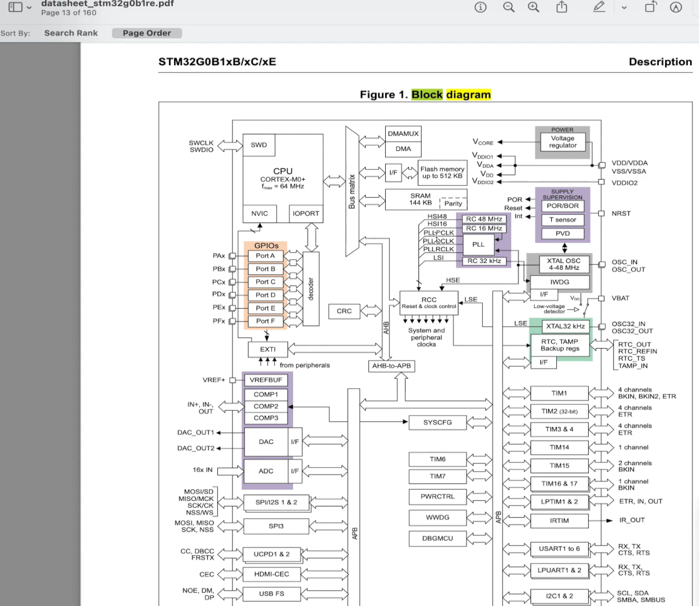

# STM32 Baremetal Blinky



- APB/AHB/etc lines are a bus, connection between peripherals
- GPIOs/DAC/ADC is a peripheral, consisting of many different ports

Based on this playlist: https://www.youtube.com/playlist?list=PLzijHiItASCkDCIj_4c-66Lve59c5lylq

## Success Build & Flash

```bash
C:\project-coding\iot\202606\stm32-baremetal-blinky>make
arm-none-eabi-gcc -mcpu=cortex-m4 -mthumb -Wall -O0 -c main.c -o main.o
arm-none-eabi-gcc -T link.ld -nostdlib main.o -lc-lm -lgcc -o firmware.elf
arm-none-eabi-objcopy -O binary firmware.elf firmware.bin

C:\project-coding\iot\202606\stm32-baremetal-blinky>make flash
"C:\Program Files\STMicroelectronics\STM32Cube\STM32CubeProgrammer\bin\STM32_Programmer_CLI.exe" -cport=SWD mode=UR -w firmware.bin 0x08000000 -rst
      -------------------------------------------------------------------
                       STM32CubeProgrammer v2.17.0
      -------------------------------------------------------------------

ST-LINK SN  : 0046002E3234510A37333934
ST-LINK FW  : V3J16M9
Board       : NUCLEO-G474RE
Voltage     : 3.28V
SWD freq    : 8000 KHz
Connect mode: Under Reset
Reset mode  : Hardware reset
Device ID   : 0x469
Revision ID : Rev X
Device name : STM32G47x/G48x
Flash size  : 512 KBytes
Device type : MCU
Device CPU  : Cortex-M4
BL Version  : 0xD5
Debug in Low Power mode enabled


Memory Programming ...
Opening and parsing file: firmware.bin
  File          : firmware.bin
  Size          : 776.00 B
  Address       : 0x08000000


Erasing memory corresponding to segment 0:
Erasing internal memory sector 0
Download in Progress:
���������������������������������������������������������������������������������������������������� 100%

File download complete
Time elapsed during download operation: 00:00:00.083

MCU Reset

Software reset is performed

C:\project-coding\iot\202606\stm32-baremetal-blinky>
```
