# Finding the right Register

General Flow:

```text
Enable clock (RCC) → Configure mode (MODER) → Set output value (BSRR)
```

## General Memory Map

The general memory map is used to see the overall picture, and have a bigger overlook on where different peripherals registers are set at. Some MCUs might have slightly different mappings. It also shows where the flash will be at for the linker to set into

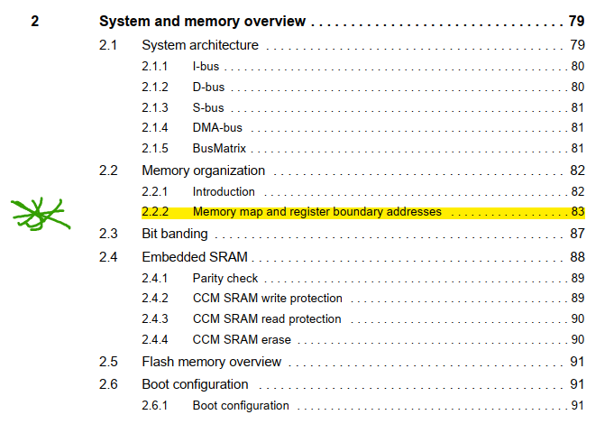
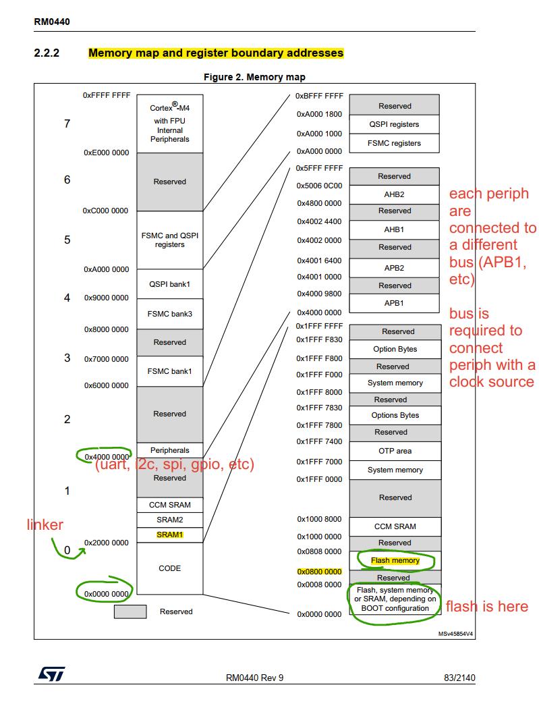
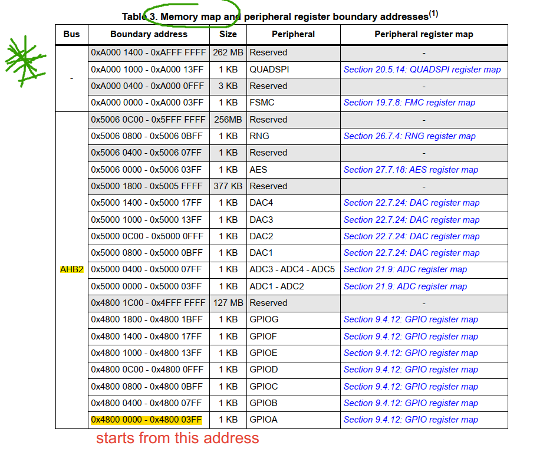
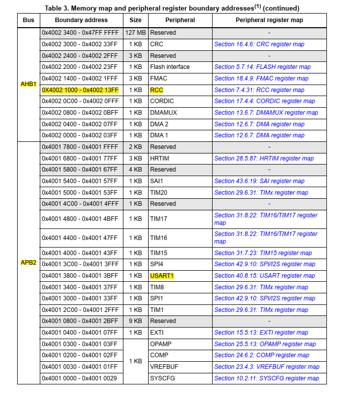

## GPIO

GPIO is the main peripheral to control the led output.

```text
Enable GPIO -> Set Mode (output) -> Set Output value (ON/OFF)
```

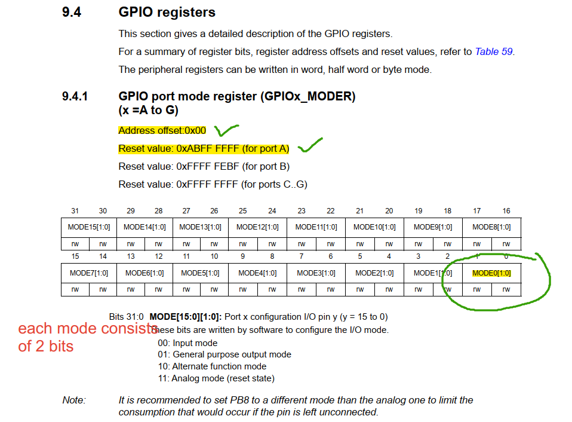
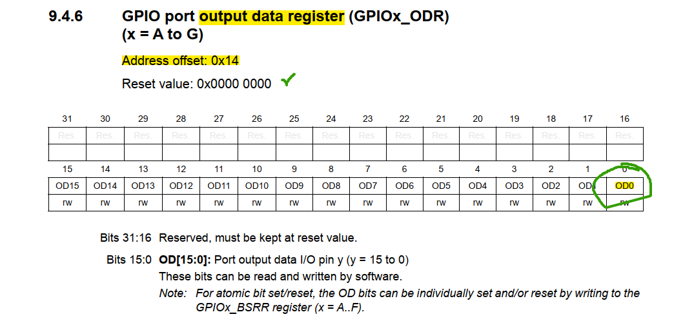
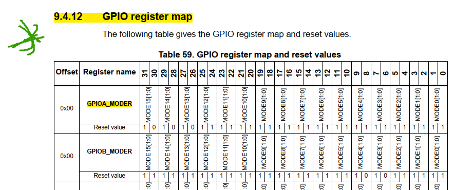
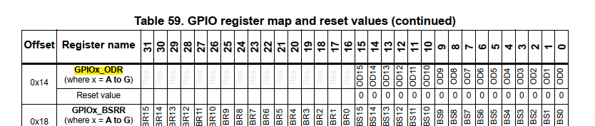

## RCC

RCC is needed to enable clock for peripherals so they can have a reference to work with

```text
Enable RCC for certain GPIO Port (Port A)
```

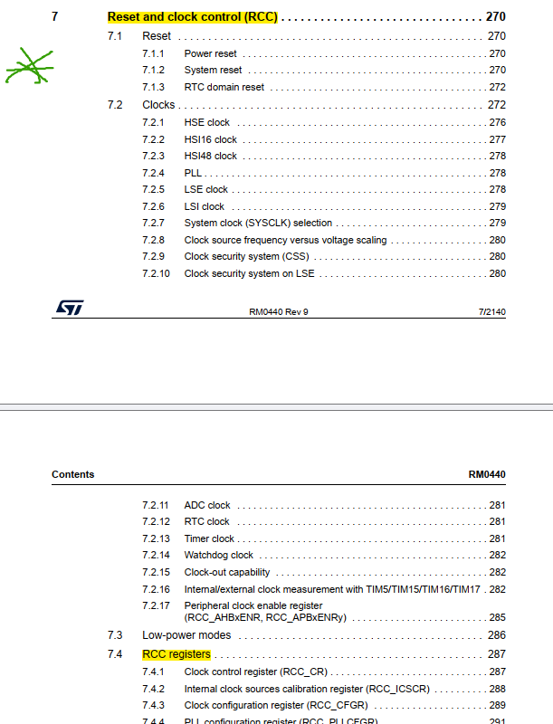
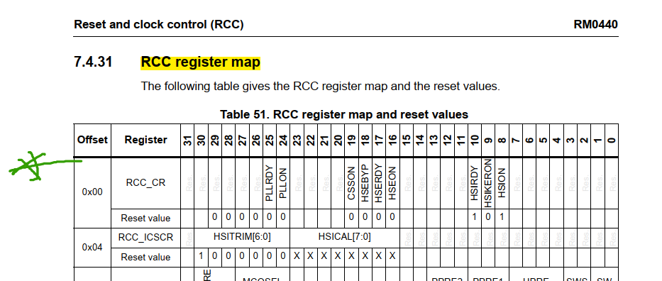
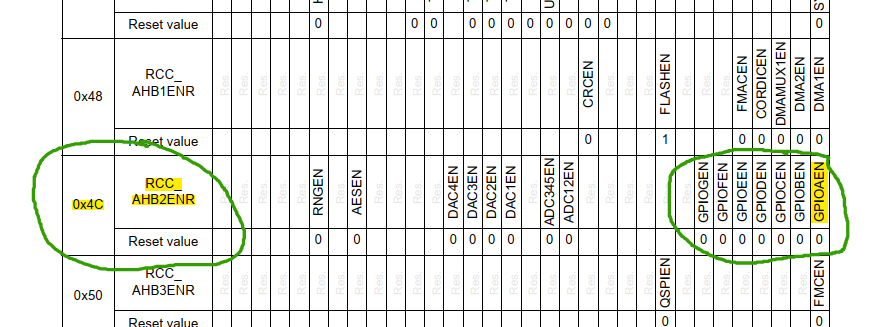